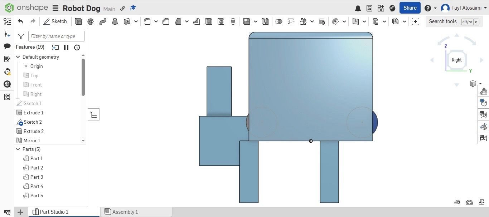

# Simple Quadruped Robot Dog
This repository presents the mechanical design of a simple quadruped robot dog created as part of the **Smart Methods Summer Training (July 2026)**.
---
## Project Overview
The goal of this project is to design a simple robot dog that can stand, balance, and perform basic walking movements. The design focuses on the basic mechanical concepts of a quadruped robot.
---
## Robot Design
### Isometric View

### Side View

---

## Mechanical Design

The robot has a simple and symmetrical mechanical design.

- The body is a rectangular chassis with smooth edges

- The robot has four legs placed evenly on both sides

- A simple head and tail were added to complete the robot shape

- The design is kept simple to focus on the basic mechanical structure of a quadruped robot

---

## Joints and Degrees of Freedom (DOF)

Each leg has two joints:

- Hip Joint

- Knee Joint

Since the robot has four legs, the total number of Degrees of Freedom (DOF) is:

**2 joints × 4 legs = 8 DOF**

This is enough to perform basic walking movements while keeping the design simple.

---

## Motor Selection

The selected actuator is the **MG996R Servo Motor**

This motor was selected because it:

- Provides good torque

- Is commonly used in robotics projects
- Is suitable for moving the robot legs
 
---

## Torque Calculation

A simple torque calculation was performed for one joint.

**Assumptions:**

- Robot mass = **2 kg**

- Gravity = **9.8 m/s²**

- Leg length = **0.05 m**

**Total Force:**

F = 2 × 9.8 ≈ **20 N**

Assuming two legs support the robot while walking:

Force on one leg = **10 N**

**Torque:**

Torque = Force × Distance

Torque = 10 × 0.05

**Torque = 0.5 N·m**

A servo motor with approximately **10 kg·cm** torque is suitable for this design.

---

## Stability and Center of Gravity

The robot has a symmetrical structure, which helps improve its balance.

The battery and electronic components should be placed near the center of the body to keep the center of gravity balanced while walking.

---

## Walking Method

The proposed walking method is the **Trot Gait**

In this walking method:

- The front-left leg moves with the rear-right leg

- The front-right leg moves with the rear-left leg

This provides good balance during movement.

---

## Expected Mechanical Challenges

Some possible mechanical challenges include:

- Keeping the robot balanced while walking

- Selecting motors with enough torque

- Preventing the legs from slipping

- Reducing the overall weight of the robot

## Repository Contents
- **Images/** – Images of the robot design
- **CAD/** – CAD design file
