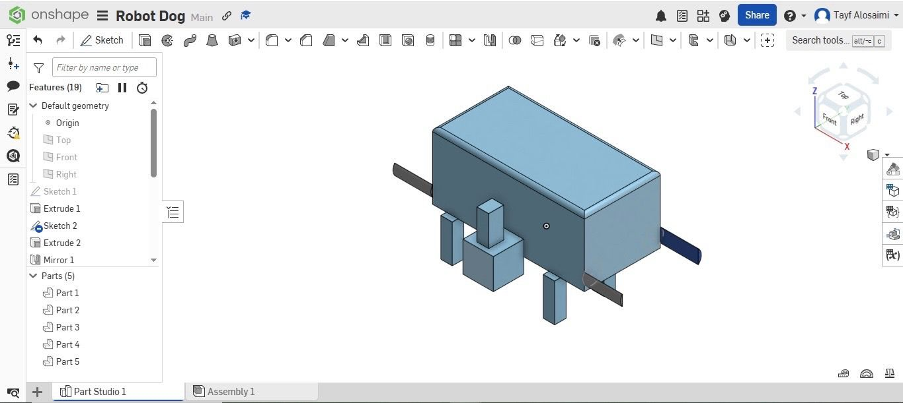

# Simple Quadruped Robot Dog
This repository presents the mechanical design of a simple quadruped robot dog created as part of the **Smart Methods Summer Training (July 2026)**.
---
## Project Overview
The goal of this project is to design a simple robot dog that can stand, balance, and perform basic walking movements. The design focuses on the basic mechanical concepts of a quadruped robot.
---
## Robot Design
### Isometric View

### Side View

---

## Mechanical Design

The robot has a simple and symmetrical mechanical design.

- The body is a rectangular chassis with smooth edges

- The robot has four legs placed evenly on both sides

- A simple head and tail were added to complete the robot shape

- The design is kept simple to focus on the basic mechanical structure of a quadruped robot

---

## Joints and Degrees of Freedom (DOF)

Each leg has two joints:

- Hip Joint

- Knee Joint

Since the robot has four legs, the total number of Degrees of Freedom (DOF) is:

**2 joints × 4 legs = 8 DOF**

This is enough to perform basic walking movements while keeping the design simple.

---

## Motor Selection

The selected actuator is the **MG996R Servo Motor**

This motor was selected because it:

- Provides good torque

- Is commonly used in robotics projects
- Is suitable for moving the robot legs
 
